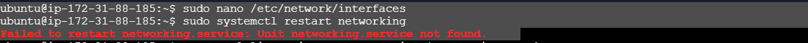
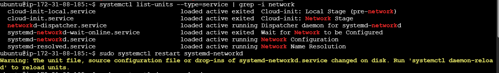
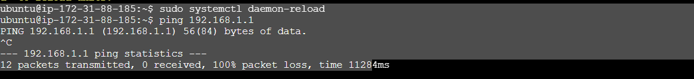
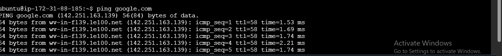
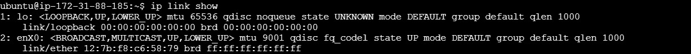
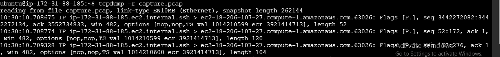
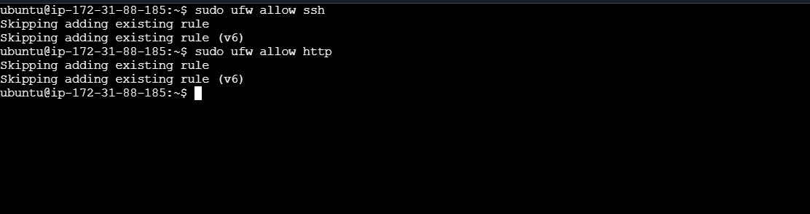
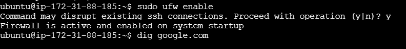
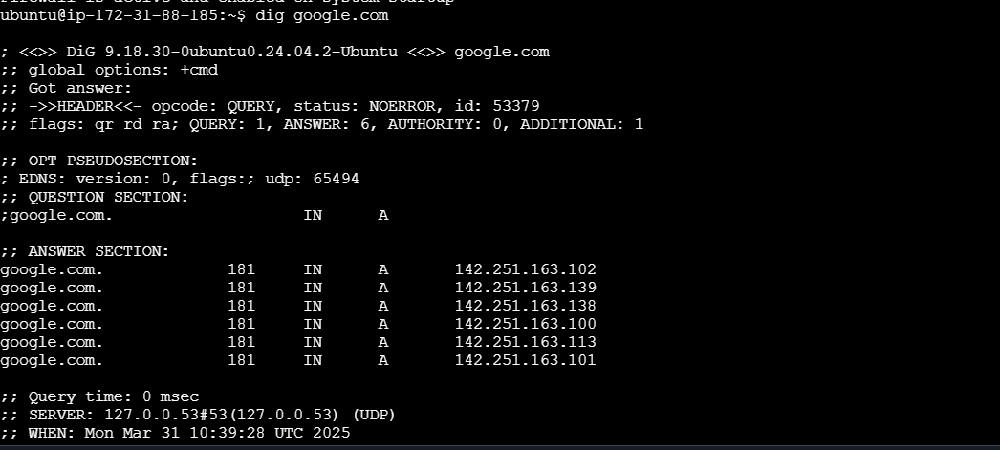

# network-config
 ## Set a Static IP Address
 
 
 ## used sudo systemctl restart systemd-networkd instead of sudo systemctl restart networking
 
 

 ## ping google.com
 

 ## capture network traffic on the eth0 interface 
 sudo tcpdump -i enX0 -w capture.pcap
 

 ## Analyze the captured traffic 
 

 ## Set Up a Firewal
sudo ufw allow ssh
sudo ufw allow http
sudo ufw enable

## Troubleshoot DNS
dig google.com

